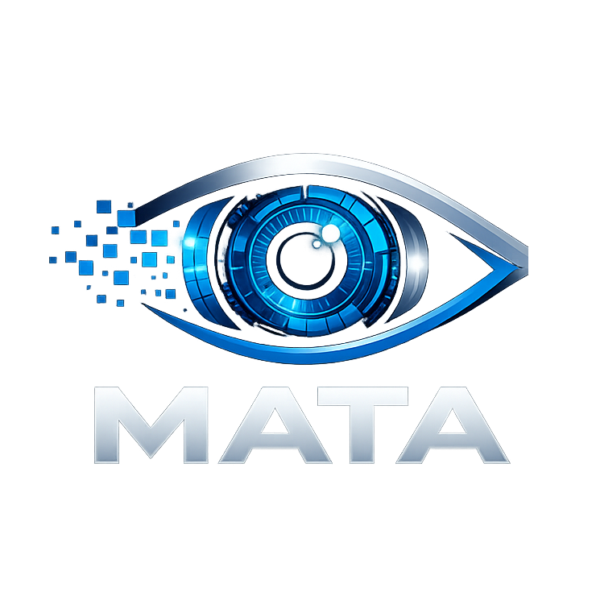

<p align="center">
  
</p>

<h3 align="center">MATA | Model-Agnostic Task Architecture</h3>

<p align="center">
    A <strong>task-centric</strong>, <strong>model-agnostic</strong> framework for computer vision that provides a YOLO-like UX on top of modular, license-safe backends.
</p>

<p align="center">
  
  
  
  
</p>

---

MATA focuses on **stable task contracts** and **pluggable runtimes**, allowing you to switch between different models and frameworks without changing your code.

## 🎯 Key Features

- **Universal Model Loading**: llama.cpp-style loading - use any model by HuggingFace ID, file path, or alias
- **Multi-Task Support**: Detection, classification, segmentation, depth estimation, OCR (text extraction), vision-language models, and multi-modal pipelines
- **Zero-Shot Capabilities**: CLIP (classify), GroundingDINO/OWL-ViT (detect), SAM/SAM3 (segment) - no training required
- **Vision-Language Models**: Image captioning, VQA, and visual understanding with Qwen3-VL and more
- **Multi-Format Runtime**: PyTorch ✅ | ONNX Runtime ✅ | TorchScript ✅ | Torchvision ✅ | TensorRT (planned)
- **Graph System** (v1.6): Multi-task workflows with `mata.infer()`, parallel execution, conditional branching, and video tracking
- **Object Tracking** (v1.8): `mata.track()` — Video/stream tracking with vendored ByteTrack and BotSort, persistent track IDs, trajectory trails, and CSV/JSON export
- **OCR / Text Extraction** (v1.9): `mata.run("ocr", ...)` — extract printed and handwritten text using GOT-OCR2, TrOCR, EasyOCR, PaddleOCR, or Tesseract with per-region confidence and bounding boxes
- **Validation & Evaluation**: `mata.val()` — mAP/accuracy/depth metrics against COCO, ImageNet, or custom datasets
- **Export & Visualization**: Save as JSON/CSV/image overlays/crops with dual backends (PIL/matplotlib)
- **Task-First API**: Specify what you want (detect, segment, classify, depth, ocr, vlm), not which model to use
- **Model-Agnostic**: Swap models without changing code - all models implement the same task contracts
- **Config Aliases**: Define shortcuts for commonly used models in YAML config files
- **License-Safe**: Apache 2.0 licensed with clear separation of components
- **Auto-Discovery**: Automatic architecture detection from model IDs and file formats

## 📦 Installation

### CPU-Only Installation (Smaller, works everywhere)

```bash
git clone https://github.com/datamata-io/mata.git
cd MATA

# Install PyTorch CPU version first
pip install torch torchvision --index-url https://download.pytorch.org/whl/cpu

# Then install MATA
pip install -e .
```

### GPU Installation (Faster, requires NVIDIA GPU + CUDA)

```bash
git clone https://github.com/datamata-io/mata.git
cd MATA

# Install PyTorch with CUDA 12.1 support (check your CUDA version)
pip install torch torchvision --index-url https://download.pytorch.org/whl/cu121

# Then install MATA
pip install -e .
```

**Check your CUDA version**: Run `nvidia-smi` to see your CUDA version, then choose the appropriate PyTorch wheel:

- CUDA 11.8: `https://download.pytorch.org/whl/cu118`
- CUDA 12.1: `https://download.pytorch.org/whl/cu121`
- CUDA 12.4: `https://download.pytorch.org/whl/cu124`
- CUDA 12.6: `https://download.pytorch.org/whl/cu126`
- CUDA 13.0: `https://download.pytorch.org/whl/cu130`
- CPU only: `https://download.pytorch.org/whl/cpu`

**📖 Need help choosing?** See [INSTALLATION.md](INSTALLATION.md) for:

- Detailed GPU vs CPU comparison
- How to switch between GPU and CPU
- Troubleshooting GPU installation issues
- Verifying your installation

See also [PyTorch Get Started](https://pytorch.org/get-started/locally/) for more options.

### Development Installation

```bash
pip install -e ".[dev]"
```

### Optional Dependencies

```bash
# For ONNX model support
pip install onnxruntime  # CPU
pip install onnxruntime-gpu  # GPU

# For publication-quality visualizations
pip install matplotlib
```

## 🚀 Quick Start

### Object Detection

```python
import mata

# Transformer-based detection (RT-DETR)
result = mata.run("detect", "image.jpg",
    model="PekingU/rtdetr_r18vd",
    threshold=0.4)

# CNN-based detection (Apache 2.0, torchvision)
result = mata.run("detect", "image.jpg",
    model="torchvision/retinanet_resnet50_fpn",
    threshold=0.4)

# Access detections
for det in result.instances:
    print(f"{det.label_name}: {det.score:.2f} at {det.bbox}")
```

### Image Classification

```python
import mata

# Standard classification
result = mata.run("classify", "image.jpg",
    model="microsoft/resnet-50")

print(f"Top prediction: {result.top1.label_name} ({result.top1.score:.2%})")

# Access top-5 predictions
for cls in result.top5:
    print(f"{cls.label_name}: {cls.score:.2%}")
```

### Instance & Panoptic Segmentation

```python
import mata

# Instance segmentation (countable objects)
result = mata.run("segment", "image.jpg",
    model="facebook/mask2former-swin-tiny-coco-instance",
    threshold=0.5)

# Panoptic segmentation (instances + stuff)
result = mata.run("segment", "image.jpg",
    model="facebook/mask2former-swin-tiny-coco-panoptic",
    segment_mode="panoptic")

# Filter results
instances = result.get_instances()  # Countable objects
stuff = result.get_stuff()          # Background regions
```

### Depth Estimation

```python
import mata

result = mata.run("depth", "image.jpg",
    model="depth-anything/Depth-Anything-V2-Small-hf",
    normalize=True)

# Save with colormap
result.save("depth.png", colormap="magma")
```

### Multi-Task Graph System (New in v1.6)

Execute complex multi-task vision workflows with strongly-typed graphs:

```python
import mata
from mata.nodes import Detect, Filter, PromptBoxes, Fuse

# Load models
detector = mata.load("detect", "IDEA-Research/grounding-dino-tiny")
segmenter = mata.load("segment", "facebook/sam-vit-base")

# Run multi-task graph
result = mata.infer(
    image="image.jpg",
    graph=[
        Detect(using="detector", text_prompts="cat . dog", out="dets"),
        Filter(src="dets", score_gt=0.3, out="filtered"),
        PromptBoxes(using="segmenter", dets="filtered", out="masks"),
        Fuse(dets="filtered", masks="masks", out="final"),
    ],
    providers={"detector": detector, "segmenter": segmenter}
)

# Access results
print(f"Detected {len(result.final.detections)} objects")
print(f"Segmented {len(result.final.masks)} instances")
```

Run independent tasks in parallel for 1.5-3x speedup:

```python
from mata.nodes import Detect, Classify, EstimateDepth, Fuse
from mata.core.graph import Graph

result = mata.infer(
    image="scene.jpg",
    graph=Graph("scene_analysis").parallel([
        Detect(using="detector", out="dets"),
        Classify(using="classifier", text_prompts=["indoor", "outdoor"], out="cls"),
        EstimateDepth(using="depth", out="depth"),
    ]).then(
        Fuse(dets="dets", classification="cls", depth="depth", out="scene")
    ),
    providers={
        "detector": mata.load("detect", "facebook/detr-resnet-50"),
        "classifier": mata.load("classify", "openai/clip-vit-base-patch32"),
        "depth": mata.load("depth", "depth-anything/Depth-Anything-V2-Small-hf"),
    }
)
```

Use pre-built presets for common workflows:

```python
from mata.presets import grounding_dino_sam, full_scene_analysis

# One-liner detection + segmentation
result = mata.infer("image.jpg", grounding_dino_sam(), providers={...})
```

**Backward Compatible**: All existing `mata.load()` and `mata.run()` APIs work unchanged.

See [Graph System Guide](docs/GRAPH_SYSTEM_GUIDE.md) | [API Reference](docs/GRAPH_API_REFERENCE.md) | [Cookbook](docs/GRAPH_COOKBOOK.md) | [Examples](examples/graph/)

### Real-World Industry Scenarios

MATA includes 20 ready-to-use scenarios for industrial applications:

| Industry               | Scenarios                                                     | Example                                           |
| ---------------------- | ------------------------------------------------------------- | ------------------------------------------------- |
| **Manufacturing**      | Defect detection, assembly verification, component inspection | `from mata.presets import defect_detect_classify` |
| **Retail**             | Shelf analysis, product search, stock assessment              | `from mata.presets import shelf_product_analysis` |
| **Autonomous Driving** | Distance estimation, scene analysis, traffic tracking         | `from mata.presets import road_scene_analysis`    |
| **Security**           | Crowd monitoring, suspicious object detection                 | `from mata.presets import crowd_monitoring`       |
| **Agriculture**        | Disease classification, aerial crop analysis, pest detection  | `from mata.presets import aerial_crop_analysis`   |
| **Healthcare**         | ROI segmentation, report generation, pathology triage         | See examples                                      |

See [Real-World Scenarios Guide](docs/REAL_WORLD_SCENARIOS.md) | [Example Scripts](examples/graph/scenarios/)

### Object Tracking (New in v1.8)

Track objects across video frames using ByteTrack or BotSort — with persistent track IDs:

```python
import mata

# Track objects in a video file (returns list[VisionResult])
results = mata.track(
    "video.mp4",
    model="facebook/detr-resnet-50",
    tracker="botsort",   # or "bytetrack"
    conf=0.3,
    save=True,
    show_track_ids=True,
)

for frame_idx, result in enumerate(results):
    for inst in result.instances:
        print(f"Frame {frame_idx}: Track #{inst.track_id} "
              f"{inst.label_name} ({inst.score:.2f}) @ {inst.bbox}")
```

**Memory-efficient streaming** for long videos and RTSP streams:

```python
# stream=True returns a generator — constant memory regardless of video length
for result in mata.track("rtsp://camera/stream",
                         model="facebook/detr-resnet-50",
                         stream=True):
    active = [i for i in result.instances if i.track_id is not None]
    print(f"Active tracks: {len(active)}")
```

**Low-level persistent tracking** (`persist=True`):

```python
import cv2
import mata

tracker = mata.load("track", "facebook/detr-resnet-50", tracker="bytetrack")
cap = cv2.VideoCapture("video.mp4")

while cap.isOpened():
    ret, frame = cap.read()
    if not ret:
        break
    result = tracker.update(frame, persist=True)
    # result.instances have .track_id set
cap.release()
```

**Graph-based tracking pipelines:**

```python
from mata.nodes import Detect, Filter, Track, Annotate

graph = [
    Detect(using="detr", out="dets"),
    Filter(src="dets", labels=["person", "car"], out="filtered"),
    Track(using="botsort", dets="filtered", out="tracks"),
    Annotate(using="drawer", dets="tracks", show_track_ids=True, out="annotated"),
]
result = mata.infer(graph=graph, video="video.mp4", providers={...})
```

#### Supported Source Types

| Source          | Example           | Notes                                  |
| --------------- | ----------------- | -------------------------------------- |
| Video file      | `"video.mp4"`     | `.mp4`, `.avi`, `.mkv`, `.mov`, `.wmv` |
| RTSP stream     | `"rtsp://..."`    | Live camera feeds                      |
| HTTP stream     | `"http://..."`    | IP cameras, web streams                |
| Webcam          | `0` (int)         | Local camera by device index           |
| Image directory | `"frames/"`       | Sorted by filename                     |
| Single image    | `"image.jpg"`     | Returns 1-frame result                 |
| numpy array     | `np.ndarray`      | Direct frame input                     |
| PIL Image       | `Image.open(...)` | Direct frame input                     |

#### ByteTrack vs BotSort

| Feature       | ByteTrack                 | BotSort                                     |
| ------------- | ------------------------- | ------------------------------------------- |
| Algorithm     | Two-stage IoU association | IoU + Global Motion Compensation (GMC)      |
| Camera motion | ❌ No                     | ✅ Sparse optical flow compensation         |
| Speed         | Faster                    | Slightly slower                             |
| Accuracy      | Good                      | Better (especially for panning cameras)     |
| Default       | No                        | **Yes** (MATA default, matches Ultralytics) |
| ReID          | ❌ v1.8                   | ❌ v1.8 (planned for v1.9)                  |

**Configuration via YAML:**

```yaml
# .mata/models.yaml
models:
  track:
    highway-cam:
      source: "facebook/detr-resnet-50"
      tracker: botsort
      tracker_config:
        track_high_thresh: 0.6
        track_buffer: 60
      frame_rate: 30
```

```python
tracker = mata.load("track", "highway-cam")
```

See [Tracking Examples](examples/track/) | [Quick Reference](QUICK_REFERENCE.md#object-tracking)

### OCR / Text Extraction (New in v1.9)

Extract text from images and documents using any of five backends:

```python
import mata

# EasyOCR — 80+ languages, polygon bounding boxes
result = mata.run("ocr", "document.jpg", model="easyocr")
print(result.full_text)
for region in result.regions:
    print(f"{region.text!r} (confidence: {region.score:.2f}) @ {region.bbox}")

# PaddleOCR — multilingual, strong on non-Latin scripts
result = mata.run("ocr", "document.jpg", model="paddleocr", lang="zh")

# Tesseract — classic open-source engine
result = mata.run("ocr", "scan.tiff", model="tesseract", lang="eng")

# HuggingFace GOT-OCR2 — state-of-the-art end-to-end OCR
result = mata.run("ocr", "document.jpg",
    model="stepfun-ai/GOT-OCR-2.0-hf")

# HuggingFace TrOCR — best for single text-line crops
result = mata.run("ocr", "line_crop.png",
    model="microsoft/trocr-base-handwritten")
```

**Export results** in multiple formats:

```python
result.save("output.txt")   # plain text
result.save("output.csv")   # CSV: text, score, x1, y1, x2, y2
result.save("output.json")  # structured JSON
result.save("overlay.png")  # image with bbox overlays

# Filter by confidence
high_conf = result.filter_by_score(0.85)
```

**Pipeline: detect text regions, then OCR each crop:**

```python
from mata.nodes import Detect, Filter, ExtractROIs, OCR, Fuse

graph = (
    Detect(using="detector", out="dets")
    >> Filter(src="dets", label_in=["sign", "license_plate"], out="filtered")
    >> ExtractROIs(src_dets="filtered", out="rois")
    >> OCR(using="ocr_engine", src="rois", out="ocr_result")
    >> Fuse(out="final", dets="filtered", ocr="ocr_result")
)

result = mata.infer(graph, image="street.jpg", providers={
    "detector":  mata.load("detect", "facebook/detr-resnet-50"),
    "ocr_engine": mata.load("ocr", "easyocr"),
})
```

See [OCR Architecture Summary](docs/OCR_IMPLEMENTATION_SUMMARY.md)

### Vision-Language Understanding

```python
import mata

# Image description
result = mata.run("vlm", "image.jpg",
    model="Qwen/Qwen3-VL-2B-Instruct",
    prompt="Describe this image in detail.")
print(result.text)

# Visual question answering
result = mata.run("vlm", "image.jpg",
    model="Qwen/Qwen3-VL-2B-Instruct",
    prompt="How many people are in this image?")
print(f"Answer: {result.text}")

# Domain-specific analysis with system prompt
result = mata.run("vlm", "product.jpg",
    model="Qwen/Qwen3-VL-2B-Instruct",
    prompt="Describe any defects you see.",
    system_prompt="You are a manufacturing quality inspector. Be precise and technical.")

# Structured output parsing (v1.5.4+)
result = mata.run("vlm", "image.jpg",
    model="Qwen/Qwen3-VL-2B-Instruct",
    prompt="List all objects you see.",
    output_mode="detect")
for entity in result.entities:
    print(f"{entity.label}: {entity.score:.2f}")

# Auto-promotion: VLM bboxes → Instance objects (v1.5.4+)
# Enables direct comparison with spatial detection models
result = mata.run("vlm", "image.jpg",
    model="Qwen/Qwen3-VL-2B-Instruct",
    prompt="Detect objects with bboxes in JSON format.",
    output_mode="detect",
    auto_promote=True)  # Bboxes in JSON → Instance objects
for instance in result.instances:
    print(f"{instance.label_name}: {instance.bbox} ({instance.score:.2f})")

# Multi-image comparison (v1.5.4+)
result = mata.run("vlm", "image1.jpg",
    model="Qwen/Qwen3-VL-2B-Instruct",
    images=["image2.jpg"],
    prompt="What's different between these images?")
print(result.text)
```

## 📚 Available Detection Models

### Transformer Models (HuggingFace)

- **RT-DETR** (facebook/rt-detr-\*): Fast, anchor-free transformer (recommended)
- **DETR** (facebook/detr-\*): Original detection transformer
- **Grounding DINO** (IDEA-Research/grounding-dino-\*): Zero-shot detection

### CNN Models (Torchvision - Apache 2.0)

- **RetinaNet** (torchvision/retinanet_resnet50_fpn): Fast, single-stage (~40 FPS)
- **Faster R-CNN** (torchvision/fasterrcnn_resnet50_fpn_v2): High accuracy (~25 FPS)
- **FCOS** (torchvision/fcos_resnet50_fpn): Anchor-free detection (~30 FPS)
- **SSD** (torchvision/ssd300_vgg16): Very fast, mobile-friendly (~60 FPS)

| Model           | Type        | mAP (COCO) | Speed (RTX 3080) | License    |
| --------------- | ----------- | ---------- | ---------------- | ---------- |
| RT-DETR R18     | Transformer | 40.7       | ~50 FPS          | Apache 2.0 |
| RetinaNet       | CNN         | 39.8       | ~40 FPS          | Apache 2.0 |
| Faster R-CNN V2 | CNN         | 42.2       | ~25 FPS          | Apache 2.0 |
| DETR ResNet-50  | Transformer | 42.0       | ~20 FPS          | Apache 2.0 |

### Universal Model Loading

MATA features llama.cpp-style universal loading - load any model by path or ID:

```python
import mata

# Load from HuggingFace (auto-detects model type)
detector = mata.load("detect", "facebook/detr-resnet-50")

# Load from local ONNX file
detector = mata.load("detect", "model.onnx", threshold=0.4)

# Load from config alias (setup in ~/.mata/models.yaml)
detector = mata.load("detect", "rtdetr-fast")

# Run inference
result = detector.predict("image.jpg")
```

## 🎯 Zero-Shot Capabilities

Perform vision tasks without training on specific classes - just provide text prompts.

### Zero-Shot Classification (CLIP)

Classify images into runtime-defined categories:

```python
import mata

# Basic zero-shot classification
result = mata.run("classify", "image.jpg",
    model="openai/clip-vit-base-patch32",
    text_prompts=["cat", "dog", "bird", "car"])

print(f"Prediction: {result.top1.label_name} ({result.top1.score:.2%})")

# Use ensemble templates for +2-5% accuracy
result = mata.run("classify", "image.jpg",
    model="openai/clip-vit-base-patch32",
    text_prompts=["cat", "dog", "bird"],
    template="ensemble")  # 7 prompt variations
```

**When to use CLIP:**

- Novel categories not in ImageNet
- Dynamic category lists (user-defined)
- Rapid prototyping without training
- Domain-specific classification

### Zero-Shot Detection (GroundingDINO / OWL-ViT)

Detect objects using text descriptions:

```python
import mata

# Text-prompted object detection
result = mata.run("detect", "image.jpg",
    model="IDEA-Research/grounding-dino-tiny",
    text_prompts="cat . dog . person . car",  # Dot-separated
    threshold=0.25)

# Multiple phrases
result = mata.run("detect", "image.jpg",
    model="google/owlv2-base-patch16",
    text_prompts="red apple . green apple . banana")
```

**When to use text-prompted detection:**

- Detecting objects not in COCO dataset (80 classes)
- Attribute-specific detection ("red car", "open door")
- Rare object detection without training data

### Zero-Shot Segmentation (SAM / SAM3)

Segment any object with prompts:

```python
import mata

# Point-based segmentation (click coordinates)
result = mata.run("segment", "image.jpg",
    model="facebook/sam-vit-base",
    point_prompts=[(320, 240, 1)],  # (x, y, foreground)
    threshold=0.8)

# Box-based segmentation (region of interest)
result = mata.run("segment", "image.jpg",
    model="facebook/sam-vit-base",
    box_prompts=[(50, 50, 400, 400)])  # (x1, y1, x2, y2)

# Text-based segmentation (SAM3 - 270K+ concepts)
result = mata.run("segment", "image.jpg",
    model="facebook/sam3",
    text_prompts="cat",
    threshold=0.5)
```

**When to use SAM:**

- Interactive segmentation workflows
- Novel object segmentation (not in training sets)
- Class-agnostic mask generation
- Combined with detection pipelines

## 🎭 Segmentation Tasks

MATA supports **four segmentation modes**: instance, panoptic, semantic, and **zero-shot** (SAM).

### Instance, Panoptic, and Semantic Segmentation

```python
import mata

# Instance segmentation (countable objects)
result = mata.run(
    "segment",
    "image.jpg",
    model="facebook/mask2former-swin-tiny-coco-instance",
    threshold=0.5
)

# Panoptic segmentation (instances + stuff)
result = mata.run(
    "segment",
    "image.jpg",
    model="facebook/mask2former-swin-tiny-coco-panoptic",
    segment_mode="panoptic"
)

# Semantic segmentation (per-pixel classification)
result = mata.run(
    "segment",
    "image.jpg",
    model="nvidia/segformer-b0-finetuned-ade-512-512"
)

# Filter results
instances = result.get_instances()  # Countable objects
stuff = result.get_stuff()          # Background regions
```

### Zero-Shot Segmentation (SAM - Segment Anything)

**New in v1.5.1**: SAM enables prompt-based segmentation without training on specific classes.

```python
import mata

# Point prompt (click on object)
result = mata.run(
    "segment",
    "image.jpg",
    model="facebook/sam-vit-base",
    point_prompts=[(320, 240, 1)],  # (x, y, foreground)
    threshold=0.8  # Filter low-quality masks
)

# Box prompt (region of interest)
result = mata.run(
    "segment",
    "image.jpg",
    model="facebook/sam-vit-base",
    box_prompts=[(50, 50, 400, 400)]  # (x1, y1, x2, y2)
)

# Combined prompts for refinement
result = mata.run(
    "segment",
    "image.jpg",
    model="facebook/sam-vit-base",
    point_prompts=[(320, 240, 1), (100, 100, 0)],  # Foreground + background
    box_prompts=[(50, 50, 450, 450)],
    threshold=0.85
)

# SAM returns 3 masks per prompt - use the best one
best_mask = result.masks[0]  # Already sorted by IoU score
print(f"IoU: {best_mask.score:.3f}, Area: {best_mask.area} pixels")
```

**SAM Features**:

- ✅ Class-agnostic (segments any object with prompts)
- ✅ Multi-mask output (3 predictions per prompt with IoU scores)
- ✅ Point prompts (foreground/background clicks)
- ✅ Box prompts (rectangular regions)
- ✅ Combined prompting for refinement

**When to use SAM**:

- Segmenting novel objects (not in COCO/ADE20K datasets)
- Interactive segmentation workflows
- When class labels are not needed
- Prompt-based mask generation

**SAM Models**:

- `facebook/sam-vit-base`: Fast, good quality (recommended for prototyping)
- `facebook/sam-vit-large`: Slower, better quality
- `facebook/sam-vit-huge`: Slowest, best quality

See [examples/segment/sam_segment.py](examples/segment/sam_segment.py) for comprehensive SAM examples.

## 📋 Available Models

### Object Detection

| Model                    | HuggingFace ID                         | Runtime Support    | Description                   |
| ------------------------ | -------------------------------------- | ------------------ | ----------------------------- |
| **DETR**                 | `facebook/detr-resnet-50`              | PyTorch ✅ ONNX ✅ | Original transformer detector |
| **DINO**                 | `IDEA-Research/dino-resnet-50`         | PyTorch ✅         | High-quality detection        |
| **Conditional DETR**     | `microsoft/conditional-detr-resnet-50` | PyTorch ✅         | Fast convergence              |
| **GroundingDINO** (zero) | `IDEA-Research/grounding-dino-tiny`    | PyTorch ✅         | Text-prompted detection       |
| **OWL-ViT v2** (zero)    | `google/owlv2-base-patch16`            | PyTorch ✅         | Open-vocabulary detection     |

### Image Classification

| Model            | HuggingFace ID                           | Runtime Support                   | Description              |
| ---------------- | ---------------------------------------- | --------------------------------- | ------------------------ |
| **ResNet**       | `microsoft/resnet-50`                    | PyTorch ✅ ONNX ✅ TorchScript ✅ | Classic CNN architecture |
| **ViT**          | `google/vit-base-patch16-224`            | PyTorch ✅ ONNX ✅ TorchScript ✅ | Vision transformer       |
| **ConvNeXt**     | `facebook/convnext-base-224`             | PyTorch ✅ ONNX ✅                | Modern CNN               |
| **EfficientNet** | `google/efficientnet-b0`                 | PyTorch ✅ ONNX ✅                | Efficient scaling        |
| **Swin**         | `microsoft/swin-base-patch4-window7-224` | PyTorch ✅                        | Hierarchical transformer |
| **CLIP** (zero)  | `openai/clip-vit-base-patch32`           | PyTorch ✅                        | Zero-shot classification |

### Instance & Panoptic Segmentation

| Model           | HuggingFace ID                                 | Mode         | Description                 |
| --------------- | ---------------------------------------------- | ------------ | --------------------------- |
| **Mask2Former** | `facebook/mask2former-swin-tiny-coco-instance` | Instance     | High-quality instance masks |
| **Mask2Former** | `facebook/mask2former-swin-tiny-coco-panoptic` | Panoptic     | Instance + stuff regions    |
| **MaskFormer**  | `facebook/maskformer-swin-tiny-ade`            | Instance     | Unified segmentation        |
| **SAM** (zero)  | `facebook/sam-vit-base`                        | Prompt-based | Point/box prompts           |
| **SAM3** (zero) | `facebook/sam3`                                | Text prompts | 270K+ concepts              |

### Depth Estimation

| Model                 | HuggingFace ID                              | Description                      |
| --------------------- | ------------------------------------------- | -------------------------------- |
| **Depth Anything V2** | `depth-anything/Depth-Anything-V2-Small-hf` | Fast, good quality (recommended) |
| **Depth Anything V2** | `depth-anything/Depth-Anything-V2-Base-hf`  | Balanced speed/quality           |
| **Depth Anything V1** | `LiheYoung/depth-anything-small-hf`         | Original version                 |

### Vision-Language Models

| Model           | HuggingFace ID              | Description                                  |
| --------------- | --------------------------- | -------------------------------------------- |
| **Qwen3-VL 2B** | `Qwen/Qwen3-VL-2B-Instruct` | Fast, chat-capable VLM (recommended for dev) |

**All models support:**

- Single-image and batch inference
- PIL Images, file paths, or numpy arrays as input
- Configurable thresholds and parameters
- GPU and CPU execution
- Consistent output formats (xyxy bbox, RLE masks, etc.)

## 🏗️ Architecture

MATA separates concerns into layers:

```
User Code (mata.run() / mata.load() / mata.infer())
         ↓
UniversalLoader (Auto-detection chain)
         ↓
   Task Adapters (HuggingFace / ONNX / TorchScript / PyTorch)
         ↓                          ↓
  VisionResult (Single-task)    Graph System (Multi-task v1.6)
    ├─ instances: List[Instance]    ├─ Artifact type system
    ├─ entities: List[Entity]       ├─ Task nodes & providers
    └─ text: str (VLM responses)    ├─ Parallel/conditional execution
         ↓                          └─ MultiResult output
  Runtime Layer (PyTorch / ONNX Runtime / TorchScript)
         ↓
 Export & Visualization (JSON/CSV/Image/Crops)
```

**Multi-Modal Pipeline Support:**

```
GroundingDINO (text → bbox) + SAM (bbox → mask) = Instance Segmentation
VLM (semantic) → GroundingDINO (spatial) → SAM (masks) = VLM-Grounded Segmentation
```

### Key Concepts

- **Task**: What you want to accomplish (detect, segment, classify, depth, vlm, pipeline)
- **Adapter**: Model-specific implementation of a task contract
- **UniversalLoader**: Auto-detects model source (HuggingFace ID, local file, config alias)
- **VisionResult**: Unified result type supporting multi-modal outputs
  - **Instance**: Spatial detections/segments (bbox + mask + embedding)
  - **Entity**: Semantic labels from VLM output (label + score + attributes)
- **Graph** (v1.6): Directed acyclic graph of typed nodes with auto-wiring
  - **Node**: Typed processing unit (Detect, Filter, Fuse, etc.)
  - **Provider**: Protocol-based model wrapper with capability detection
  - **MultiResult**: Bundled output from multi-task graph execution
- **Runtime**: Execution backend (PyTorch, ONNX Runtime, TorchScript, TensorRT planned)

## 💾 Export & Visualization

### Save Results in Multiple Formats

```python
import mata

result = mata.run("detect", "image.jpg")

# Auto-format detection based on file extension
result.save("output.json")     # JSON with detections
result.save("output.csv")      # CSV table format
result.save("output.png")      # Image with bbox overlays

# Export detection crops
result.save("crops/", crop_dir="crops/")  # Individual object images
```

### Visualization Options

```python
from mata import visualize_segmentation

# Segmentation visualization with custom settings
result = mata.run("segment", "image.jpg",
    model="facebook/mask2former-swin-tiny-coco-instance")

vis = visualize_segmentation(
    result,
    "image.jpg",
    alpha=0.6,           # Mask transparency
    show_boxes=True,     # Show bounding boxes
    show_labels=True,    # Show class labels
    show_scores=True,    # Show confidence scores
    backend="matplotlib" # or "pil" (default)
)
vis.show()
vis.save("segmentation_output.png")
```

### Depth Visualization with Colormaps

```python
result = mata.run("depth", "image.jpg",
    model="depth-anything/Depth-Anything-V2-Small-hf",
    normalize=True)

# Save with different colormaps
result.save("depth_magma.png", colormap="magma")    # Hot colors
result.save("depth_viridis.png", colormap="viridis") # Blue-green
result.save("depth_plasma.png", colormap="plasma")   # Purple-yellow
```

### Auto-Image Storage

MATA automatically stores the input image path in result metadata:

```python
result = mata.run("detect", "my_image.jpg")
result.save("output.png")  # ✅ Auto-uses stored input path
# No need to pass image path again!
```

## 🧪 Testing

```bash
# Run all tests (4047+ total)
pytest tests/ -v

# Run with coverage (target: >80%)
pytest --cov=mata --cov-report=html

# Run specific test suites
pytest tests/test_classify_adapter.py -v            # Classification (35 tests)
pytest tests/test_segment_adapter.py -v             # Segmentation (30 tests)
pytest tests/test_clip_adapter.py -v                # CLIP zero-shot (46 tests)
pytest tests/test_sam_adapter.py -v                 # SAM segmentation (19 tests)
pytest tests/test_torchvision_detect_adapter.py -v  # Torchvision CNN (32 tests)
pytest tests/test_vlm_adapter.py -v                 # VLM (63 tests, 57 unit + 6 slow integration)

# Tracking test suites (v1.8)
pytest tests/test_trackers/ -v                      # Vendored trackers (354 tests)
pytest tests/test_tracking_adapter.py -v            # TrackingAdapter (73 tests)
pytest tests/test_track_api.py -v                   # mata.track() public API (62 tests)
pytest tests/test_tracking_visualization.py -v      # Visualization & export (103 tests)
pytest tests/test_video_io.py -v                    # Video I/O utilities (56 tests)
```

**Test Coverage by Task:**

- Detection: 72+ tests (HuggingFace, ONNX, TorchScript, Torchvision, zero-shot)
- Classification: 35+ tests (multi-format, CLIP)
- Segmentation: 30+ tests (instance, panoptic, SAM, SAM3)
- Depth: 10+ tests (Depth Anything V1/V2)
- VLM: 63 tests (57 unit tests + 6 slow integration tests, includes structured output + multi-image)
- Graph System: 1000+ tests (nodes, scheduler, conditionals, presets, infer API, backward compat)
- Universal Loader: 17 tests (5-strategy detection chain)
- **Object Tracking: 687 tests** (vendored trackers, adapter, API, visualization, video I/O)

## 🧪 Validation & Evaluation

`mata.val()` evaluates any model against a labeled dataset and returns structured metrics for all four supported tasks.

### Quick Reference

```python
import mata

# Detection — COCO mAP
metrics = mata.val(
    "detect",
    model="facebook/detr-resnet-50",
    data="examples/configs/coco.yaml",
    iou=0.50,
    conf=0.001,
    verbose=True,
    save_dir="runs/val/detect",
)
print(f"mAP50    : {metrics.box.map50:.3f}")
print(f"mAP50-95 : {metrics.box.map:.3f}")

# Segmentation — box + mask mAP
metrics = mata.val(
    "segment",
    model="shi-labs/oneformer_coco_swin_large",
    data="examples/configs/coco.yaml",
    verbose=True,
)
print(f"Box  mAP50 : {metrics.box.map50:.3f}")
print(f"Mask mAP50 : {metrics.seg.map50:.3f}")

# Classification — top-k accuracy
metrics = mata.val(
    "classify",
    model="microsoft/resnet-101",
    data="examples/configs/imagenet.yaml",
    verbose=True,
)
print(f"Top-1 : {metrics.top1:.1%}")
print(f"Top-5 : {metrics.top5:.1%}")

# Depth — AbsRel / RMSE / δ thresholds
metrics = mata.val(
    "depth",
    model="depth-anything/Depth-Anything-V2-Small-hf",
    data="examples/configs/diode.yaml",
    verbose=True,
)
print(f"AbsRel   : {metrics.abs_rel:.4f}")
print(f"RMSE     : {metrics.rmse:.4f}")
print(f"δ < 1.25 : {metrics.delta_1:.1%}")
```

### Sample Console Output (detection, verbose=True)

```
Class          Images  Instances  P       R       mAP50   mAP50-95
all              5000     36335  0.512   0.487   0.491    0.312
person           5000     10777  0.681   0.621   0.643    0.421
car              5000      1918  0.574   0.531   0.548    0.387
...

Speed: pre-process 2.1ms, inference 48.3ms, post-process 1.8ms per image
Results saved to runs/val/detect/
```

### Dataset YAML Format

Create a YAML file that points `mata.val()` at your dataset. The format is YOLO-compatible:

```yaml
# examples/configs/coco.yaml
path: /data/coco # root directory (absolute or relative to CWD)
val: images/val2017 # sub-directory containing validation images
annotations: annotations/instances_val2017.json # COCO-format annotation JSON
names: # optional: class-index → name mapping
  0: person
  1: bicycle
  2: car
  # ...
```

For classification and depth, the format is the same — only the annotation content differs:

```yaml
# examples/configs/imagenet.yaml
path: /data/imagenet
val:  val
annotations: imagenet_val_labels.json   # {filename: class_index} mapping

# examples/configs/diode.yaml
path: /data/diode
val:  val/indoors
annotations: diode_val_depth.json       # {filename: depth_npy_path} mapping
```

### Downloading Datasets

#### COCO (Detection & Segmentation)

The [COCO 2017](https://cocodataset.org/#download) validation split is ~1 GB of images plus ~240 MB of annotations.

```bash
# Create a root directory
mkdir -p /data/coco && cd /data/coco

# Validation images (1 GB)
wget http://images.cocodataset.org/zips/val2017.zip
unzip val2017.zip          # → val2017/

# Annotations (241 MB — includes instances, captions, keypoints)
wget http://images.cocodataset.org/annotations/annotations_trainval2017.zip
unzip annotations_trainval2017.zip   # → annotations/
```

Expected layout:

```
/data/coco/
├── images/val2017/          # ~5 000 validation images
└── annotations/
    └── instances_val2017.json
```

Point `coco.yaml` at this directory:

```yaml
path: /data/coco
val: images/val2017
annotations: annotations/instances_val2017.json
```

#### ImageNet (Classification)

The [ImageNet ILSVRC 2012](https://image-net.org/download) validation split requires a free account on image-net.org. Once downloaded:

```bash
mkdir -p /data/imagenet && cd /data/imagenet

# Unpack the official validation archive (supplied by image-net.org)
tar -xvf ILSVRC2012_img_val.tar          # → val/  (50 000 JPEG images)

# Unpack the bbox annotations (also supplied by image-net.org)
tar -xvf ILSVRC2012_bbox_val_v3.tgz      # → bbox_val/  (50 000 XML files)

# Generate the MATA annotation file from the XML ground truth
cd /path/to/MATA
python scripts/generate_imagenet_val_labels.py
# → data/imagenet/imagenet_val_labels.json  (50 000 entries, 1 000 classes)
```

Expected layout:

```
/data/imagenet/
├── val/                       # 50 000 validation images (flat directory)
├── bbox_val/                  # 50 000 XML ground-truth annotations
└── imagenet_val_labels.json   # {filename: class_index} mapping (generated)
```

Point `imagenet.yaml` at this directory:

```yaml
path: /data/imagenet
val: val
annotations: imagenet_val_labels.json
```

> **Tip:** Many research groups mirror a 10 000-image mini-val subset. Any folder of ImageNet validation images with a matching `imagenet_val_labels.json` file will work.

#### DIODE (Depth Estimation)

[DIODE](https://diode-dataset.org/) provides high-quality outdoor and indoor depth maps. Download the **validation split** only (~5 GB):

```bash
mkdir -p /data/diode && cd /data/diode

# Indoor validation split (~2.3 GB)
wget http://diode-dataset.s3.amazonaws.com/val.tar.gz
tar -xvf val.tar.gz          # → val/indoors/ and val/outdoors/

# Generate the MATA annotation file from the dataset
python scripts/build_diode_depth_gt.py --diode-root /data/diode/val --output /data/diode/diode_val_depth.json
```

Expected layout:

```
/data/diode/
├── val/
│   ├── indoors/     # scene_*/scan_*/  — RGB .png + depth .npy pairs
│   └── outdoors/
└── diode_val_depth.json   # {rel_rgb_path: rel_depth_npy_path} mapping
```

Point `diode.yaml` at this directory:

```yaml
path: /data/diode
val: val/indoors # or val/outdoors for outdoor scenes
annotations: diode_val_depth.json
```

### Standalone Mode (pre-run predictions)

Compute metrics from predictions collected earlier — useful when inference runs separately (e.g. on a GPU cluster):

```python
# Step 1: collect predictions however you like
predictions = [mata.run("detect", img, model="facebook/detr-resnet-50") for img in images]

# Step 2: score against ground truth without re-running inference
metrics = mata.val(
    "detect",
    predictions=predictions,
    ground_truth="annotations.json",   # COCO-format JSON
    iou=0.50,
    conf=0.001,
    verbose=True,
)
```

See [`examples/validation.py`](examples/validation.py) for complete, runnable examples of all four tasks plus the standalone workflow.

## 📊 Result Format

All detection results follow a consistent format:

```json
{
  "detections": [
    {
      "bbox": [x1, y1, x2, y2],
      "score": 0.95,
      "label": 0,
      "label_name": "person"
    }
  ],
  "meta": {
    "model_id": "facebook/detr-resnet-50",
    "threshold": 0.4,
    "device": "cuda"
  }
}
```

**Coordinate System**: All bboxes are in `xyxy` format with absolute pixel coordinates.

## ⚙️ Configuration

Override defaults via configuration file or environment:

```python
from mata import MATAConfig, set_config

config = MATAConfig(
    default_device="cuda",
    default_models={"detect": "dino"},
    cache_dir="/path/to/cache",
    log_level="DEBUG"
)
set_config(config)
```

Or via environment variable:

```bash
export MATA_CONFIG=/path/to/config.json
```

## 🛣️ Roadmap

> **For a full history of completed features, see [CHANGELOG.md](CHANGELOG.md).**

### 🔄 In Progress

#### **1. Tracking ReID** — Re-identification for cross-camera / occlusion recovery

- ⏳ **ReID model integration**: Feature embeddings via HuggingFace ReID models
- ⏳ **Cross-camera tracking**: Match track IDs across camera feeds
- ⏳ **BotSort ReID mode**: Enable `with_reid=true` in botsort config
- **Status**: Planned for v1.9.x

#### **2. KACA Integration** - MIT-licensed CNN detection with PyTorch and ONNX support

- ⏳ **KACA PyTorch Adapter**: Direct PyTorch model loading and inference
- ⏳ **KACA ONNX Adapter**: Production deployment without PyTorch dependency
- ⏳ **Universal Loader Integration**: `mata.load("detect", "kaca/det-s")`
- ⏳ **Performance**: Target ~45 FPS on GPU for 640x640 input (10-20x faster than DETR)
- **Status**: Waiting for KACA Development Team to release HuggingFace models and ONNX exports (expected Q3 2026).

#### **2. HuggingFace Hub Features** - Enhanced model discovery and management

- 🔄 **Local Model Indexing**: Cache HuggingFace Hub queries for offline usage
- 🔄 **Model Recommendations**: Suggest best models based on task and hardware constraints
- 🔄 **Batch Model Download**: Pre-download common models for air-gapped environments
- 🔄 **Enhanced Search**: Filter by task, license, performance metrics
- **Status**: Planned for v2.x

### ⏳ Planned (v2.0 - Q2 2026)

- 🔲 **Training Module**: Fine-tuning support for detection and classification
- 🔲 **TensorRT Production**: Optimized inference for NVIDIA GPUs (10-50x speedup)
- 🔲 **Mobile Deployment**: ONNX quantization and mobile runtime support (TFLite, CoreML)
- 🔲 **Model Zoo**: Pre-trained weights for common tasks and datasets
- 🔲 **Benchmark Suite**: Performance comparisons across models and runtimes
- 🔲 **Video Processing Pipeline**: Optimized frame-by-frame inference with temporal cache
- 🔲 **Breaking Changes**: Remove all deprecated APIs, clean v2.0 architecture

### 🔬 Research Concepts (v2.x)

#### **V2L HyperLoRA** — Vision-to-LoRA fast-lane adaptation for new object classes

Inspired by [Doc-to-LoRA](https://arxiv.org/abs/2602.15902) (Sakana AI, 2026), V2L HyperLoRA adapts the hypernetwork concept from language to vision: a pre-trained hypernetwork takes **5–20 annotated images** of a new object and generates RT-DETR LoRA weights in a **single forward pass** (~100ms). No retraining required.

- 🔬 **HyperLoRA generator**: Hypernetwork produces LoRA(A, B) matrices + class head bias for 34 RT-DETR Linear layers
- 🔬 **DINOv2 visual context encoder**: Frozen DINOv2-Small encodes exemplar crops + Fourier bbox positional encoding into dense context features
- 🔬 **Dynamic class head extension**: `class_embed` Linear layer extended for new classes while preserving COCO-80 detection
- 🔬 **Eval-mode LoRA patching**: Thread-safe monkey-patching of `nn.Linear.forward` — no gradient tracking, reversible via `reset()`
- 🔬 **LoRA adapter serialization**: ~50–200 KB `.safetensors` files deployable to edge devices
- 🔬 **`mata.load("detect", ..., fast_lane=True)` API**: Returns `ModulatedDetector` with `.adapt(examples)` / `.predict()` / `.reset()` lifecycle
- 🔬 **Fast lane / slow lane architecture**: Fast lane covers the detection gap instantly; slow lane (full retrain) eventually retires the adapter
- 🔬 **Scope**: RT-DETR (R18/R50/R101, v1/v2) only — backbone frozen, 34 encoder/decoder Linear layers targeted
- **Status**: Concept research — hypernetwork meta-training pipeline and dataset design in progress

### 🔮 Future Exploration (v2.5+)

- 🔮 **3D Vision**: Point cloud, depth fusion, 3D object detection
- 🔮 **Enhanced VLM**: Multi-image support, video understanding, structured output parsing
- 🔮 **Edge Deployment**: Raspberry Pi, Jetson Nano optimization
- 🔮 **Auto-ML**: Neural architecture search for custom tasks

## 📄 License

MATA is licensed under the **Apache License 2.0**. See [LICENSE](LICENSE) and [NOTICE](NOTICE) for full details.

> **⚠️ Model Weights Are Not Covered by This License**
>
> MATA is a software framework only — it does **not** distribute model weights. When you load a model
> via `mata.load()`, the weights are fetched from HuggingFace Hub or your local filesystem, and are
> governed by their **own separate license**. You are responsible for complying with those terms.

Common model licenses you may encounter:

| License                | Examples                                                          | Key Restriction                                                               |
| ---------------------- | ----------------------------------------------------------------- | ----------------------------------------------------------------------------- |
| Apache 2.0             | DETR, RT-DETR, GroundingDINO, SAM, Depth Anything V2, Mask2Former | ✅ Permissive — commercial use allowed                                        |
| MIT                    | CLIP (OpenAI)                                                     | ✅ Permissive — commercial use allowed                                        |
| Tongyi Qianwen         | Qwen-VL series                                                    | ⚠️ [Custom terms](https://huggingface.co/Qwen) — review before commercial use |
| Meta Community License | LLaMA-based VLMs                                                  | ⚠️ Usage thresholds and restrictions apply                                    |
| CC-BY-NC               | Various fine-tuned models                                         | 🔴 Non-commercial use only                                                    |
| AGPL-3.0               | Some open-source fine-tunes                                       | 🔴 Copyleft — derivative works must be open-sourced                           |

Some models on HuggingFace Hub require you to accept gated terms before downloading. MATA passes your HuggingFace credentials to the Hub client but does not validate or enforce model-specific license agreements on your behalf.

## 🤝 Contributing

Contributions welcome! Please ensure:

- All code is Apache 2.0 compatible
- Tests pass and coverage >80%
- Code follows Black formatting
- Type hints included

## 📚 Documentation

- [Architecture Document](docs/MATA_MultiTask_Vision_Architecture.md) - System architecture and design
- [Zero-Shot Detection Guide](docs/ZEROSHOT_DETECTION_GUIDE.md) - SAM, GroundingDINO, CLIP zero-shot guide
- [Quick Start Guide](QUICKSTART.md) - Getting started with MATA
- [Installation Guide](INSTALLATION.md) - Detailed installation instructions
- [Config Template](examples/tools/models.yaml) - Model configuration examples
- API Reference: See docstrings in `src/mata/`

**Graph System (v1.6):**

- [Graph System Guide](docs/GRAPH_SYSTEM_GUIDE.md) - Architecture overview and design principles
- [Graph API Reference](docs/GRAPH_API_REFERENCE.md) - Full API documentation for all nodes, artifacts, and schedulers
- [Graph Cookbook](docs/GRAPH_COOKBOOK.md) - Recipes and patterns for common workflows
- [Graph Examples](examples/graph/) - 5 runnable examples (pipelines, parallel, VLM, presets, and more)

**Object Tracking (v1.8):**

- [Basic Tracking](examples/track/basic_tracking.py) - Video file tracking with save output
- [Persistent Tracking](examples/track/persist_tracking.py) - Frame-by-frame with `persist=True`
- [Stream Tracking](examples/track/stream_tracking.py) - Memory-efficient generator mode
- [Graph Tracking](examples/graph/video_tracking.py) - Graph pipeline integration

**Examples:**

- [Basic Detection](examples/detect/basic_detection.py)
- [Traditional Segmentation](examples/segment/basic_segmentation.py)
- [SAM Zero-Shot Segmentation](examples/segment/sam_segment.py)
- [Simple Pipeline (Graph)](examples/graph/simple_pipeline.py)
- [Parallel Tasks (Graph)](examples/graph/parallel_tasks.py)
- [VLM Workflows (Graph)](examples/graph/vlm_workflows.py)
- [Presets Demo (Graph)](examples/graph/presets_demo.py)

### Common Issues

**Getting 0 detections?**

- RT-DETR models often need lower thresholds (0.2-0.3)
- Try: `result = mata.run("detect", "image.jpg", threshold=0.2)`
- Check `mata.list_models("detect")` to verify available model aliases

**Model loading slow?**

- First run downloads models from HuggingFace (~100-500MB)
- Subsequent runs use cached models

## 🙏 Acknowledgments

Built on top of:

- [HuggingFace Transformers](https://github.com/huggingface/transformers)
- [PyTorch](https://pytorch.org/)
- [ONNX Runtime](https://onnxruntime.ai/)

Models:

- RT-DETRv2: PekingU
- DINO: IDEA-Research
- Conditional DETR: Microsoft
