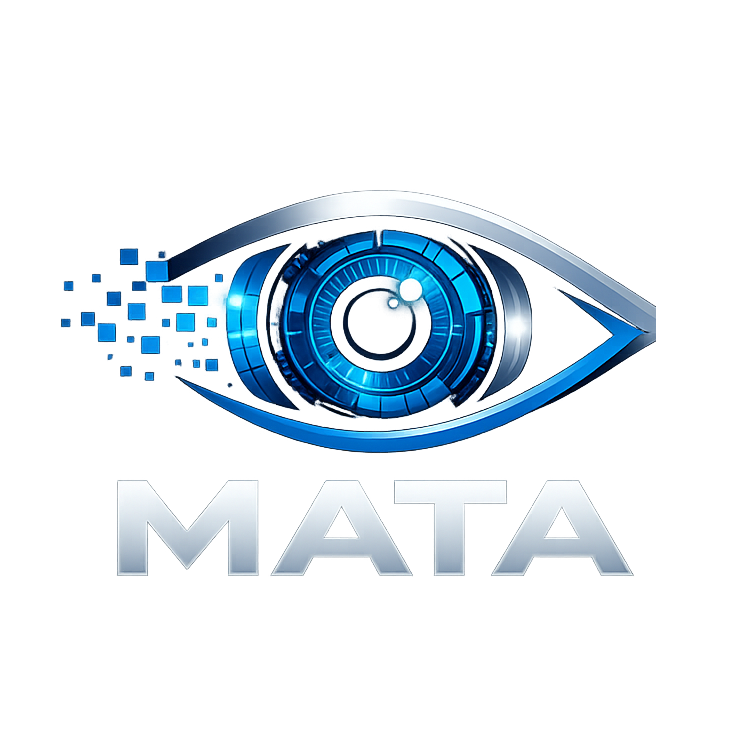
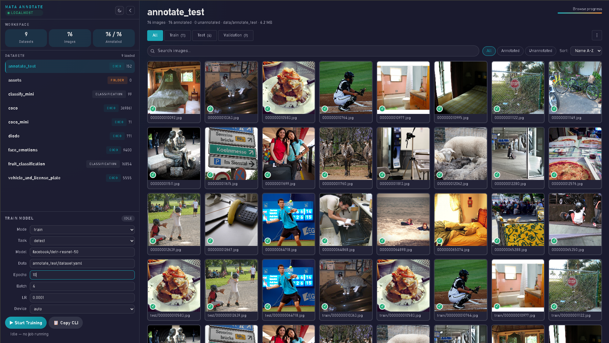
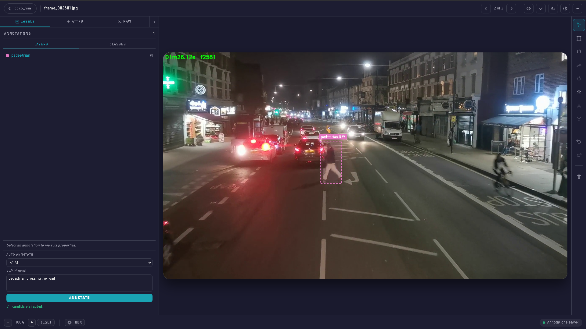

<p align="center">
  
</p>

<h3 align="center">MATA | Model-Agnostic Task Architecture</h3>

<p align="center">
    Write your vision pipeline once. Swap any model — HuggingFace, ONNX, Torchvision — without changing a line of code.
</p>

<p align="center">
  
  
  
  
</p>

---

**For ML engineers and CV practitioners** who want YOLO-like simplicity with HuggingFace-scale model choice. MATA is a task-centric computer vision framework built on four ideas:

1. **Universal model loading** — load any model by HuggingFace ID, local ONNX file, or config alias with one API
2. **Composable graph pipelines** — wire Detect → Segment → Embed into typed DAGs with parallel execution, conditional branching, and control flow
3. **Zero-shot everything** — CLIP classify, GroundingDINO detect, SAM segment — no training required
4. **Local annotation loop** — launch a browser-based dataset editor with `mata annotate` and export training-ready COCO + YAML assets

## See It in Action

**One-liner inference** — any HuggingFace model, three lines:

```python
import mata

result = mata.run("detect", "image.jpg", model="facebook/detr-resnet-50")
for det in result.instances:
    print(f"{det.label_name}: {det.score:.2f} at {det.bbox}")
```

**Multi-task graph pipeline** — MATA's unique power. Compose tasks into typed, parallel workflows:

```python
import mata
from mata.nodes import Detect, Filter, PromptBoxes, Fuse

result = mata.infer(
    image="image.jpg",
    graph=[
        Detect(using="detector", text_prompts="cat . dog", out="dets"),
        Filter(src="dets", score_gt=0.3, out="filtered"),
        PromptBoxes(using="segmenter", dets="filtered", out="masks"),
        Fuse(dets="filtered", masks="masks", out="final"),
    ],
    providers={
        "detector":  mata.load("detect", "IDEA-Research/grounding-dino-tiny"),
        "segmenter": mata.load("segment", "facebook/sam-vit-base"),
    }
)
```

**CLI** — run from the terminal, no script needed:

```bash
mata run detect image.jpg --model facebook/detr-resnet-50 --conf 0.4 --save
mata track video.mp4 --model facebook/detr-resnet-50 --tracker botsort --save
mata recognize person.jpg --gallery gallery.npz --model openai/clip-vit-base-patch32
mata annotate --data data
```

## Installation

```bash
pip install datamata
```

For GPU acceleration, install PyTorch with CUDA first:

```bash
pip install torch torchvision --index-url https://download.pytorch.org/whl/cu126
pip install datamata
```

See [INSTALLATION.md](INSTALLATION.md) for CUDA version table, optional dependencies (ONNX, barcode, notebook, Valkey), and troubleshooting.

## Core Tasks

### Detection

```python
result = mata.run("detect", "image.jpg", model="facebook/detr-resnet-50", threshold=0.4)
for det in result.instances:
    print(f"{det.label_name}: {det.score:.2f} at {det.bbox}")
```

### Classification

```python
result = mata.run("classify", "image.jpg", model="microsoft/resnet-50")
print(f"Top-1: {result.top1.label_name} ({result.top1.score:.2%})")
```

### Segmentation

```python
result = mata.run("segment", "image.jpg",
    model="facebook/mask2former-swin-tiny-coco-instance", threshold=0.5)
instances = result.get_instances()
```

### Depth Estimation

```python
result = mata.run("depth", "image.jpg",
    model="depth-anything/Depth-Anything-V2-Small-hf")
result.save("depth.png", colormap="magma")
```

### And More

| Task            | One-liner                                                                     | Guide                                            |
| --------------- | ----------------------------------------------------------------------------- | ------------------------------------------------ |
| **OCR**         | `mata.run("ocr", "doc.jpg", model="easyocr")`                                 | [OCR Guide](docs/OCR_IMPLEMENTATION_SUMMARY.md)  |
| **Tracking**    | `mata.track("video.mp4", model="...", tracker="botsort")`                     | [Tracking Guide](docs/TRACKING_GUIDE.md)         |
| **VLM**         | `mata.run("vlm", "img.jpg", model="Qwen/Qwen3-VL-2B-Instruct", prompt="...")` | [VLM Guide](docs/VLM_MODEL_SUPPORT.md)           |
| **Embedding**   | `mata.run("embed", "img.jpg", model="openai/clip-vit-base-patch32")`          | [Embed Example](examples/inference/embedding.py) |
| **Barcode**     | `mata.run("barcode", "img.jpg", model="pyzbar")`                              | [Barcode Examples](examples/barcode/)            |
| **Recognition** | `mata.run("recognize", "img.jpg", gallery=gallery, model="...")`              | [Recognition Guide](docs/RECOGNITION_GUIDE.md)   |
| **Annotation**  | `mata.annotate(data="data", block=False)`                                     | [Annotation Guide](docs/ANNOTATION_GUIDE.md)     |

## What Makes MATA Different

### Graph Pipelines

Compose multi-task workflows as typed directed graphs. Run independent tasks in parallel for 1.5-3x speedup:

**Example 1 — Parallel multi-task scene analysis (image):**

```python
from mata.nodes import Detect, Classify, EstimateDepth, Fuse
from mata.core.graph import Graph

result = mata.infer(
    image="scene.jpg",
    graph=Graph("scene_analysis").parallel([
        Detect(using="detector", out="dets"),
        Classify(using="classifier", text_prompts=["indoor", "outdoor"], out="cls"),
        EstimateDepth(using="depth", out="depth"),
    ]).then(
        Fuse(dets="dets", classification="cls", depth="depth", out="scene")
    ),
    providers={
        "detector":   mata.load("detect",   "facebook/detr-resnet-50"),
        "classifier": mata.load("classify", "openai/clip-vit-base-patch32"),
        "depth":      mata.load("depth",    "depth-anything/Depth-Anything-V2-Small-hf"),
    }
)
```

**Example 2 — Natural-language video semantic search:**

```python
from mata.nodes import IndexVideo, EmbeddingSearch
from mata.core.graph import Graph

embedder = mata.load("embed", "Qwen/Qwen3-VL-Embedding-2B", dtype="bfloat16")

result = (
    Graph("urban_traffic_search")
    .then(IndexVideo(using="embedder", mode="frame", sample_fps=1.0))
    .then(EmbeddingSearch(
        using="embedder",
        text=[
            "person dangerously jaywalking between moving vehicles",
            "cyclist weaving through fast-moving traffic at night",
            "vehicle making an abrupt lane change near pedestrians",
        ],
        top_k=3,
        threshold=0.18,
    ))
).run(video="dashcam.mp4", providers={"embedder": embedder})

for qr in result["search_results"].results:
    print(f'"{qr.query}"')
    for rank, m in enumerate(qr.matches, 1):
        mm, ss = int(m.start_s) // 60, int(m.start_s) % 60
        print(f"  #{rank}  sim={m.similarity:.4f}  @ {mm:02d}m{ss:02d}s")
```

Control flow primitives (v1.9.5) — `EarlyExit`, `While`, and `Graph.add(condition=...)` for quality gates, feedback loops, and adaptive pipelines.

Pre-built presets for common workflows:

```python
from mata.presets import grounding_dino_sam, full_scene_analysis
result = mata.infer("image.jpg", grounding_dino_sam(), providers={...})
```

See [Graph API Reference](docs/GRAPH_API_REFERENCE.md) | [Cookbook](docs/GRAPH_COOKBOOK.md) | [Examples](examples/graph/)

### Zero-Shot Vision

Perform any vision task without training — just provide text prompts:

```python
# Classify into arbitrary categories
result = mata.run("classify", "image.jpg",
    model="openai/clip-vit-base-patch32",
    text_prompts=["cat", "dog", "bird"])

# Detect objects by description
result = mata.run("detect", "image.jpg",
    model="IDEA-Research/grounding-dino-tiny",
    text_prompts="red apple . green apple . banana")

# Segment anything with point/box/text prompts
result = mata.run("segment", "image.jpg",
    model="facebook/sam-vit-base",
    point_prompts=[(320, 240, 1)])
```

See [Zero-Shot Guide](docs/ZEROSHOT_DETECTION_GUIDE.md) for CLIP, GroundingDINO, OWL-ViT, SAM, and SAM3 details.

### Object Tracking

Track objects across video with persistent IDs, ReID, and streaming support:

```python
# One-liner video tracking
results = mata.track("video.mp4",
    model="facebook/detr-resnet-50", tracker="botsort", conf=0.3, save=True)

# Memory-efficient streaming for RTSP / long videos
for result in mata.track("rtsp://camera/stream",
                         model="facebook/detr-resnet-50", stream=True):
    print(f"Active tracks: {len(result.instances)}")

# Appearance-based ReID — recover IDs after occlusion
results = mata.track("video.mp4", model="facebook/detr-resnet-50",
    reid_model="openai/clip-vit-base-patch32")
```

ByteTrack and BotSort are fully vendored — no external tracking dependencies. See [Tracking Guide](docs/TRACKING_GUIDE.md) for ByteTrack vs BotSort comparison, cross-camera ReID, and YAML config.

### Command-Line Interface

```bash
mata run detect image.jpg --model facebook/detr-resnet-50 --conf 0.4 --save
mata run classify image.jpg --model microsoft/resnet-50 --json
mata run vlm image.jpg --model Qwen/Qwen3-VL-2B-Instruct --prompt "Describe this"
mata track video.mp4 --model facebook/detr-resnet-50 --tracker botsort --save
mata val detect --data coco.yaml --model facebook/detr-resnet-50
mata annotate --data data
mata --version
```

All subcommands support `--help`. See [CLI Examples](examples/cli/) and [docs/ANNOTATION_GUIDE.md](docs/ANNOTATION_GUIDE.md).

## Supported Models

MATA works with any model from HuggingFace Transformers, Torchvision, or local ONNX/TorchScript files. Tested and recommended models:

| Task               | Representative Models                                                     | Runtimes                                |
| ------------------ | ------------------------------------------------------------------------- | --------------------------------------- |
| **Detection**      | DETR, RT-DETR, GroundingDINO, OWL-ViT, RetinaNet, Faster R-CNN, FCOS, SSD | PyTorch, ONNX, TorchScript, Torchvision |
| **Classification** | ResNet, ViT, ConvNeXt, EfficientNet, Swin, CLIP (zero-shot)               | PyTorch, ONNX, TorchScript              |
| **Segmentation**   | Mask2Former, MaskFormer, SAM, SAM3 (zero-shot)                            | PyTorch                                 |
| **Depth**          | Depth Anything V1/V2                                                      | PyTorch                                 |
| **VLM**            | Qwen3-VL, MedGemma, Florence-2, LLaVA-NeXT, SmolVLM, Moondream2, + 3 more | PyTorch                                 |
| **OCR**            | EasyOCR, PaddleOCR, Tesseract, GOT-OCR2, TrOCR                            | PyTorch                                 |
| **Embedding**      | CLIP, OSNet, X-CLIP                                                       | PyTorch, ONNX                           |
| **Barcode**        | pyzbar, zxing-cpp                                                         | Native                                  |

See [Supported Models](docs/SUPPORTED_MODELS.md) for model IDs, benchmarks, and runtime compatibility matrix.

## When NOT to Use MATA

- **Training-first workflows** — `mata.train()` is planned for v2.0.0. If training is your primary need today, use HuggingFace Trainer or PyTorch Lightning directly.
- **Edge / mobile deployment** — TensorRT and TFLite export are planned but not yet available.
- **Single-model, maximum-throughput** — MATA's adapter layer adds ~1-2ms overhead. For bare-metal speed on one model, use the runtime directly.

## Architecture

```
mata.run() / mata.load() / mata.infer()
         |
   UniversalLoader (5-strategy auto-detection)
         |
   Task Adapters (HuggingFace / ONNX / TorchScript / Torchvision)
         |                          |
   VisionResult (single-task)   Graph System (multi-task)
         |                          |
   Runtime Layer              Parallel scheduler + control flow
         |
   Export (JSON / CSV / image overlay / crops)
```

For a deep-dive into design decisions and layer contracts, see [docs/MATA_DESIGN_AND_ARCHITECTURE.md](docs/MATA_DESIGN_AND_ARCHITECTURE.md).

## Roadmap

> **v1.9.7 is the final feature release.** The 1.9.x line is now in maintenance mode.

See [CHANGELOG.md](CHANGELOG.md) for full version history.

- **v1.9.x** (maintenance) — bug fixes and documentation only
- **v2.0.0** (Q2 2026) — Annotation tooling (`mata.annotate()` / `mata annotate`), training module (`mata.train()`), quantized ONNX export, breaking API cleanup
<p align="center">
  
   <br />
  <span style="font-size: 0.78rem; color: var(--muted);">MATA's annotation and training interface, running on local and offline environments.</span>
</p>
<p align="center">
  
 <br />
  <span style="font-size: 0.78rem; color: var(--muted);">MATA's annotation interface supports bounding boxes, and Zero-shot / VLM labeling.</span>
</p>

- **v2.x** — HuggingFace Hub model recommendations, KACA CNN integration, V2L HyperLoRA research
- **v2.5+** — 3D vision, edge deployment, Auto-ML

## What's Next?

- [Quickstart Guide](QUICKSTART.md) — get running in 5 minutes
- [Notebook Examples](examples/notebooks/) — interactive Jupyter tutorials
- [Graph Cookbook](docs/GRAPH_COOKBOOK.md) — multi-task pipeline recipes
- [Real-World Scenarios](docs/REAL_WORLD_SCENARIOS.md) — 20 industry-ready pipelines
- [Quick Reference](QUICK_REFERENCE.md) — export, config, validation cheat sheet
- [Validation Guide](docs/VALIDATION_GUIDE.md) — mAP, accuracy, and depth metrics against COCO / ImageNet / DIODE

## License

Apache License 2.0. See [LICENSE](LICENSE) and [NOTICE](NOTICE).

MATA does **not** distribute model weights. Models fetched via `mata.load()` are governed by their own licenses (Apache 2.0, MIT, CC-BY-NC, etc.). You are responsible for complying with model-specific terms.

## Contributing

Contributions welcome. See [CONTRIBUTING.md](CONTRIBUTING.md) for guidelines (Apache 2.0 compatibility, >80% test coverage, Black formatting, type hints).

## Acknowledgments

Built on [HuggingFace Transformers](https://github.com/huggingface/transformers), [PyTorch](https://pytorch.org/), and [ONNX Runtime](https://onnxruntime.ai/).
